<!--
  ┌─────────────────────────────────────────────────────────────┐
  │  fawziatahia / profile README                               │
  │  Custom animated assets live in ./assets — edit them freely │
  └─────────────────────────────────────────────────────────────┘
-->

<div align="center">
  
</div>

<div align="center">
  <a href="mailto:fawziatahia@gmail.com">
    
  </a>
</div>

<div align="center">
  
  
  
</div>



## 🚀 About me

I build web applications, backend systems, and AI-powered tools — mostly Laravel on the server, JavaScript or Flutter on the front. I like the part where a messy real-world process turns into something people can actually click.

```php
<?php

final class Fawzia
{
    public string  $role     = 'Software Developer';
    public string  $studying = 'Software Engineering';
    public string  $building = 'DocSlot — Doctor Appointment Management System';
    public array   $learning = ['Clean Architecture', 'REST API design', 'AI-powered apps'];

    public function currentGoal(): string
    {
        return 'Ship things that solve real problems.';
    }
}
```

- 🔭 Building **DocSlot** — a doctor appointment management system
- 🌐 Focused on **full-stack development**
- 🤖 Exploring **AI-powered applications**
- 📚 Always picking up a new framework
- 💡 Happiest when code removes someone's busywork


## 🛠️ Tech stack

**Languages**

<div align="center">
  
  
  
  
  
  
  
</div>

**Frameworks &amp; tools**

<div align="center">
  
  
  
  
  
  
  
  
</div>


## 📂 Projects

<!-- PROJECTS:START -->
<table>
  <tr>
    <td width="50%" valign="top">
      <h3>🩺 DocSlot</h3>
      <p>A full-stack healthcare app: patients book open slots, doctors manage their schedule, admins keep the whole thing honest.</p>
      <p>
        
        
      </p>
      <p>
        <a href="https://github.com/Fawziatahia/DocSlot">→ View repo</a>
        <sub>· updated 6 days ago</sub>
      </p>
    </td>
    <td width="50%" valign="top">
      <h3>📘 yaos bd</h3>
      <p>A TypeScript project.</p>
      <p>
        
      </p>
      <p>
        <a href="https://github.com/Fawziatahia/yaos-bd">→ View repo</a>
        <sub>· updated 4 days ago</sub>
      </p>
    </td>
  </tr>
  <tr>
    <td width="50%" valign="top">
      <h3>⚙️ profileUi</h3>
      <p>using flutter</p>
      <p>
        
      </p>
      <p>
        <a href="https://github.com/Fawziatahia/profileUi">→ View repo</a>
        <sub>· updated 3 months ago</sub>
      </p>
    </td>
    <td width="50%" valign="top">
      <h3>🎨 CN Project</h3>
      <p>CN-Project</p>
      <p>
        
      </p>
      <p>
        <a href="https://github.com/Fawziatahia/CN-Project">→ View repo</a>
        <sub>· updated 4 months ago</sub>
      </p>
    </td>
  </tr>
</table>

<details>
  <summary><b>🗂️ Everything else</b> — 12 more repositories</summary>
  <br />
  <table>
      <tr><td>🎨 <a href="https://github.com/Fawziatahia/CN-Project2"><b>CN Project2</b></a></td><td>A HTML project.</td><td align="right"><sub>HTML</sub></td></tr>
      <tr><td>🐘 <a href="https://github.com/Fawziatahia/laravel_project"><b>laravel project</b></a></td><td>A Blade project.</td><td align="right"><sub>Blade</sub></td></tr>
      <tr><td>✈️ <a href="https://github.com/Fawziatahia/TravelAgent.ai"><b>TravelAgent.ai</b></a></td><td>Turns a loose travel idea into a usable plan. Built in Python, driven by an LLM.</td><td align="right"><sub>Python</sub></td></tr>
      <tr><td>🌐 <a href="https://github.com/Fawziatahia/WebDev-Project-Php"><b>Social Media App</b></a></td><td>Profiles, posts, and interactions built on a hand-rolled PHP backend.</td><td align="right"><sub>PHP</sub></td></tr>
      <tr><td>📦 <a href="https://github.com/Fawziatahia/metro_wb_project"><b>metro wb project</b></a></td><td>Source available on GitHub.</td><td align="right"><sub>—</sub></td></tr>
      <tr><td>🎨 <a href="https://github.com/Fawziatahia/Portfolio"><b>Portfolio</b></a></td><td>Using html &amp; css</td><td align="right"><sub>HTML</sub></td></tr>
      <tr><td>🐘 <a href="https://github.com/Fawziatahia/Task1_registerform"><b>Task1 registerform</b></a></td><td>A PHP project.</td><td align="right"><sub>PHP</sub></td></tr>
      <tr><td>☕ <a href="https://github.com/Fawziatahia/Ext"><b>Ext</b></a></td><td>A Java project.</td><td align="right"><sub>Java</sub></td></tr>
      <tr><td>📦 <a href="https://github.com/Fawziatahia/skills-copilot-codespaces-vscode"><b>skills copilot codespaces vscode</b></a></td><td>My clone repository</td><td align="right"><sub>—</sub></td></tr>
      <tr><td>📦 <a href="https://github.com/Fawziatahia/skills-introduction-to-github"><b>skills introduction to github</b></a></td><td>My clone repository</td><td align="right"><sub>—</sub></td></tr>
      <tr><td>🐍 <a href="https://github.com/Fawziatahia/QuizApp"><b>QuizApp</b></a></td><td>A Python project.</td><td align="right"><sub>Python</sub></td></tr>
      <tr><td>☕ <a href="https://github.com/Fawziatahia/Java-232-134-004"><b>Java 232 134 004</b></a></td><td>Fawzia Fardowsi Tahia (232-134-004) fawziatahia@gmail.com</td><td align="right"><sub>Java</sub></td></tr>
  </table>
</details>

<sub>📂 16 public repositories · auto-synced from the GitHub API on 2026-08-28</sub>
<!-- PROJECTS:END -->


## 📈 GitHub activity

<div align="center">
  
  
</div>

<div align="center">
  
</div>

<div align="center">
  
</div>

<div align="center">
  
</div>

### 🐍 Contribution snake

<div align="center">
  <picture>
    <source media="(prefers-color-scheme: dark)" srcset="https://raw.githubusercontent.com/fawziatahia/fawziatahia/output/snake-dark.svg" />
    <source media="(prefers-color-scheme: light)" srcset="https://raw.githubusercontent.com/fawziatahia/fawziatahia/output/snake.svg" />
    
  </picture>
</div>


## 🎯 Current focus

<div align="center">
  
  
  
  
</div>


## 📫 Get in touch

<div align="center">
  <a href="mailto:fawziatahia@gmail.com">
    
  </a>
  <a href="https://github.com/fawziatahia">
    
  </a>
</div>

<div align="center">
  <br />
  <i>Thanks for stopping by — if something here is useful to you, a ⭐ goes a long way.</i>
</div>


